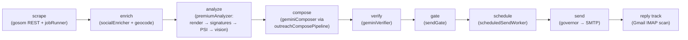

# SPEC.md — maps-scraper single source of truth

The authoritative reference for project invariants, the pipeline, and the
reuse-only module registry. Read this before any task. For feature work, the
active slice spec lives at `docs/SLICES/<id>-<name>.md`; `docs/ROADMAP.md` ranks
pending slices. This file links to — does not duplicate — `CLAUDE.md`,
`.claude/rules/architecture.md`, `.claude/rules/ui.md`, `DESIGN.md`, and
`PRODUCT.md`.

---

## Project goal

maps-scraper ("Canvass") is a personal, internal B2B lead-generation tool for a
solo operator. It scrapes businesses from Google Maps via the gosom scraper
(REST), automatically enriches and analyzes each business's digital presence,
composes evidence-anchored cold emails with Gemini, verifies every claim against
collected evidence, gates and paces sending, schedules the send, and tracks
replies. The product value is a batch of 10–15 personalized outreach emails in
under ten minutes per focused desk session — a precision instrument, not a
dashboard demo.

---

## Pipeline

- **scrape** — `jobRunner.ts` drives gosom over REST; polygon (`runJobSync`) or
  keyword (`runKeywordJobSync`). Results upserted via `upsertRawResults`.
- **enrich** — `socialEnricher.ts` (Instagram/Facebook/LinkedIn, SSRF-guarded) +
  reverse geocode. Runs automatically after every scrape; not opt-in.
- **analyze** — `premiumAnalyzer.ts`: Playwright render → signature scan → PSI →
  Gemini vision. TTL-gated reuse to skip same-week re-analysis.
- **compose → verify → gate** — `outreachComposePipeline.ts`
  (`composeVerifiedEmail`) ranks anchors (`anchorRanker`), composes
  (`geminiComposer`), verifies claims (`geminiVerifier`), repairs violations,
  then `sendGate.evaluateSendGate` allows/blocks by verdict.
- **schedule → send** — `scheduledSendWorker.ts` (30s poll) claims → gates →
  governs (`outreachGovernor.governSend`: daily cap + business window + pacing)
  → transmits SMTP.
- **reply track** — Gmail IMAP scan (every 10 min); RFC 3834 / subject / velocity
  classification; auto-replies excluded from response rate.

---

## Stack snapshot

- **Client:** React 18 + Vite 5 + TypeScript 5 + Tailwind 3.4. Leaflet 1.9.x /
  react-leaflet 4.2.x (pinned — do not upgrade). SSE only for realtime.
- **Server:** Node 20 + Express 4 + better-sqlite3 + Drizzle ORM (WAL).
  undici (HTTP), cheerio (parsing), googleapis (Sheets).
- **Scraper:** `gosom/google-maps-scraper:latest`, Docker, REST mode (`-web`).
- **AI:** Gemini for vision + compose + verify.
- **Dev topology (Docker):** gosom `:3050`, Express `:3001`, Vite `:5173`.
  Vite proxy target is `http://server:3001` (compose service name), never
  `localhost`. Server dev + tsc run **in the container on Node 20**.

The full LOCKED stack list is `CLAUDE.md` §5 — do not deviate.

---

## Invariants

Load-bearing. Breaking any breaks the app. Authoritative detail in `CLAUDE.md`
§6 and `.claude/rules/architecture.md`; the short list:

- **Additive schema only.** New columns/tables, never destructive migrations.
- **Run migrations before prepares.** Statement prepares against a not-yet-
  migrated DB throw at boot.
- **tsc clean gate.** `npx tsc --noEmit` (in the server container for server
  code) must pass before a slice is done. No ESLint/lint script — tsc only.
- **Reuse-only registry.** Call the modules below; never reimplement them.
- **Dry-run rules.** `OUTREACH_DRY_RUN=true` exercises the full send path but
  suppresses SMTP transmit — records a `dryrun` row, never flips
  contacted-state.
- **Node 20 in container** for all server dev/typecheck/scripts.
- **No false absence claims.** Before stating a symbol/file/flag doesn't exist,
  grep and confirm. Verify recalled facts against the current tree.
- **lat/lng as strings** in the DB (SQLite REAL loses precision at zoom ≥ 17).
  Parse only at render. gosom returns lat/lon as strings — `parseFloat` before
  arithmetic.
- **`booleanPointInPolygon(point, polygon)`** — turf reverses vs most libs;
  GeoJSON `[lng, lat]` order, not Leaflet `[lat, lng]`.
- **Zero-cell guard.** Grid → 0 cells ⇒ refuse the job with a user-facing
  error. Never silently dispatch nothing.
- **SQLite boot pragmas.** `PRAGMA journal_mode=WAL` and `PRAGMA
  foreign_keys=ON` on every connection. Both, every time.
- **SSRF protection in `socialEnricher.ts` is mandatory.** Resolve hostname,
  reject private/loopback ranges before fetching. No bypass flag.
- **Env validated by zod at boot** (`server/src/env.ts`). Missing required var ⇒
  crash with a clear message. No silent defaults.
- **Dedup by `place_id` only.** Nothing else is authoritative.
- **Jobs run sequentially.** No parallelism, no worker pools.
- **Social enrichment runs automatically after every scrape.** Not opt-in.
- **gosom poll loop** must see `working → ok`; gosom reports `ok` as an initial
  idle state before the job starts.
- **gosom `max_time` is seconds**, not nanoseconds.
- **Production** serves `../client/dist` as static from `server/src/index.ts`.

---

## Reuse-only registry

These modules are load-bearing. **Call them — do not reimplement.** Paths
relative to repo root.

| Module | File | Exported symbol | Purpose | Call from here |
|---|---|---|---|---|
| composer | `server/src/services/geminiComposer.ts` | `composeEmail()`, `composeFollowUp()` | AI cold / follow-up email anchored to website evidence | `routes/outreachQueue.ts:76` (generate-follow-up) |
| verifier | `server/src/services/geminiVerifier.ts` | `verifyDraft()` | Fact-check email claims vs evidence bundle (signals/vision/PSI) | `services/outreachComposePipeline.ts:90` |
| sendGate | `server/src/services/sendGate.ts` | `evaluateSendGate()` | Allow/block send by verification verdict (`SEND_ALLOWED_STATUSES`) | `services/scheduledSendWorker.ts:123` |
| governor | `server/src/services/outreachGovernor.ts` | `governSend()` | Enforce daily cap + business window + pacing; defer sends to optimal time | `services/scheduledSendWorker.ts:143` |
| engine | `server/src/services/outreachComposePipeline.ts` | `composeVerifiedEmail()` | Full compose→verify→repair loop with anchor retry; guarantees specificity (never ships a husk) | `services/batchOrchestrator.ts:17` |
| geminiRateLimiter | `server/src/services/geminiRateLimiter.ts` | `withGeminiRate()` | RPM throttle + per-attempt hard timeout + retry + RPD budget around every Gemini call | `services/geminiComposer.ts:567` |
| stageTracker | `server/src/services/stageTracker.ts` | `withAnalysis()`, `stage()`, `addCost()`, `setSummary()` | Log pipeline stages, emit `outreach:stage` SSE, accumulate Gemini cost + retries | `services/outreachComposePipeline.ts:51` |
| anchorRanker | `server/src/services/anchorRanker.ts` | `rankAnchors()` | Deterministically rank assertable evidence into prioritized anchor candidates | `services/outreachComposePipeline.ts:63` |
| scheduledSendWorker | `server/src/services/scheduledSendWorker.ts` | `tick()`, `processJob()`, `getSchedulerHealth()`, `setPaused()` | 30s poller: claim → gate → govern → send; SSE health | `server/src/index.ts` (boot interval) |
| scrapeSchedulerWorker | `server/src/services/scrapeSchedulerWorker.ts` | `startScheduler()`, `tick()`, `getScrapeSchedulerHealth()`, `setScrapeSchedulerPaused()` | 60s poller: claim & run polygon/keyword schedules, track added/deduped | `server/src/index.ts` (boot) |
| runJobSync | `server/src/services/jobRunner.ts` | `runJobSync()` | Synchronous polygon scrape: create job, await runJob, return businessesFound | `services/scrapeSchedulerWorker.ts:97` |
| runKeywordJobSync | `server/src/services/jobRunner.ts` | `runKeywordJobSync()` | Keyword scrape via gosom, upsert results, return added/deduped | `routes/keywordScrape.ts:26` |
| upsertScrapedBusinesses | `server/src/services/jobRunner.ts` | `upsertRawResults()` (internal) | Upsert raw gosom results into businesses, dedup on place_id | `jobRunner.ts:134` (from runKeywordJobSync) |

> Note: the spec referred to this last entry as `upsertScrapedBusinesses`; the
> actual symbol is `upsertRawResults()` in `jobRunner.ts`. Documented under its
> real name to avoid a false-absence trap.

---

## Conventions

- **One vertical slice at a time.** Scope each change to a single slice spec.
  Don't batch unrelated work.
- **Live verification gates.** Prove behavior with real evidence — DB rows,
  curl responses, log lines, screenshots — not unit-test assertions. See each
  slice's `## Verification gate`, filled DURING execution.
- **Diagnose-first.** Before editing, read the relevant files, catalog the
  symbols involved, and research unknowns. The slice's `## Diagnose-first
  checklist` precedes any edit; the operator approves the implementation plan
  before edits begin.
- **Reviewer subagent on the send path.** Changes to compose/verify/gate/
  governor/scheduledSendWorker get a code-review subagent pass before merge.
- **"You decide" framing.** The operator approves *what* (the plan); Claude
  picks *how* (the implementation). Surface tradeoffs; don't silently pick the
  complex path.

---

## Cost / perf budgets

From `server/src/env.ts` and `docs/diagnosis/2026-pipeline-cost-and-503.md`.

- **Gemini rate/budget:** `GEMINI_RPM` default 120 (Bottleneck in-memory, rate
  enforced by `minTime = 60000/RPM` ms spacing alone — NO reservoir: its auto-refill
  did not re-arm and wedged the lane after ~RPM calls, slice 0058); `GEMINI_RPD`
  default 1000 (persisted, Pacific-date keyed). Per-attempt hard timeout ~30s.
  Bounded retry: up to 5 inner (`withGeminiRate`) × 3 outer ⇒ ≤15 calls per email
  before giving up. Composer 503 fallback via `GEMINI_COMPOSER_FALLBACK_MODEL`. Both
  vision and compose/verify models bill $0.30/M input + $2.50/M output — output is
  ~8× input per token, so output length is the primary cost lever.
- **Playwright / analyze:** `PREMIUM_RENDER_TIMEOUT_MS` 20000 (also bounds
  `chromium.connect`); `BATCH_PREPARE_CONCURRENCY` 3 (a throttle, not a speed dial).
  Batch analyze is awaited to completion, not abandoned on a wall-clock budget
  (slice 0058) — the run-level stall watchdog is the genuine-wedge backstop.
- **Send pacing:** `OUTREACH_DAILY_CAP` 15 (rolling 24h; fresh identity, ramp to
  30 warmed). Governor enforces cap + per-business-type window + pacing delay.
- **Enrichment:** `SOCIAL_ENRICHMENT_TIMEOUT_MS` 8000, `SOCIAL_ENRICHMENT_MAX_BYTES`
  2 MB, `SOCIAL_ENRICHMENT_DELAY_MS` 1000.
- **Analysis reuse:** `REUSE_ANALYSIS_TTL_DAYS` TTL-gate skips same-week
  re-analysis (~20% of runs were redundant per the diagnosis; the bigger win is
  30–90s of latency saved per lead).

---

## Related docs

- `CLAUDE.md` — behavioral guidelines, dev commands, LOCKED stack, constraints.
- `.claude/rules/architecture.md` — folder boundaries, banned packages, gosom
  gotchas, settled decisions.
- `.claude/rules/ui.md` — UI rules (auto-loads on `client/src/**`).
- `DESIGN.md` / `PRODUCT.md` — "The Darkroom" aesthetic + product values.
- `docs/diagnosis/*` — historical cost/scheduler diagnoses (do not edit).
- `docs/superpowers/plans/*` — historical premium-analysis slice plans.
